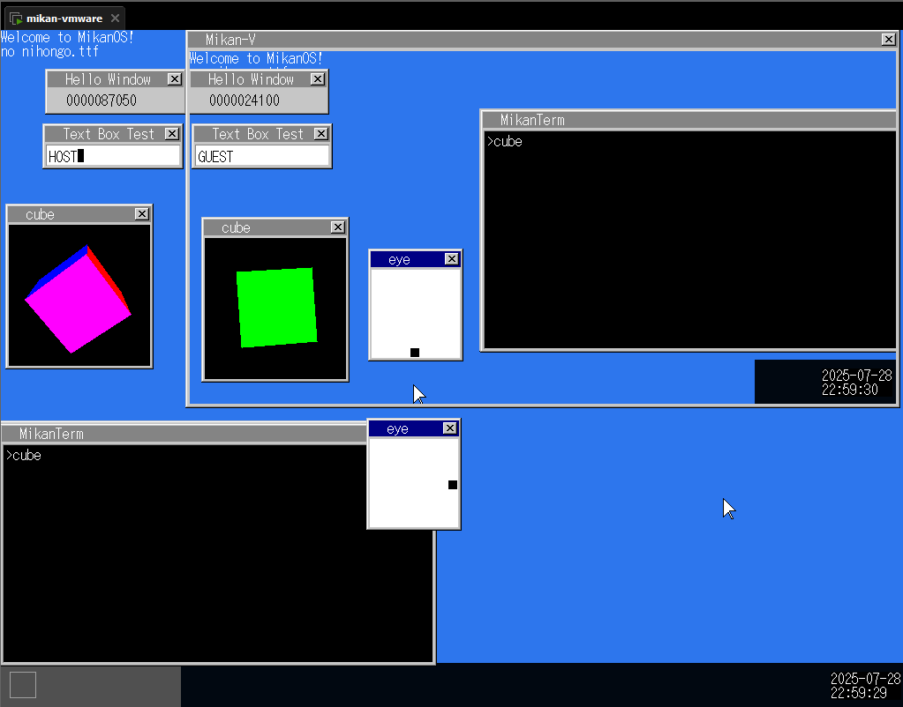

# Mikan-V

Mikan-V is an operating system that includes a Type-2 hypervisor capable of running a MikanOS virtual machine on top of MikanOS itself.  
The goal is to implement this system by adding features rather than modifying existing functionality whenever possible.


## Build Instructions

Follow the build steps provided in the [README_original.md](./README_original.md).

## How to Use

Run Mikan-V using [VMware Workstation](https://www.vmware.com/products/desktop-hypervisor/workstation-and-fusion).  
After installing VMware Workstation, create a new virtual machine and add or overwrite the following lines to the `.vmx` file, or enable the equivalent options via the GUI:

```
memsize = "1024"
vhv.enable = "TRUE"
firmware = "efi"
```

Once you’ve built the project and obtained `disk.img`, convert it to a VMDK file using the following command:

```
qemu-img convert -O vmdk disk.img <VM Name>.vmdk
```

Move the converted `<VM Name>.vmdk` file into your VMware virtual machine's directory.  
By default(Windows), this is located at: `%USERPROFILE%\Documents\Virtual Machines\<VM Name>`

After booting the VM, type `vm` in the terminal to launch Mikan-V.

## Notes

- To send the F2 key to the VM, use the F3 key instead.
- The file system is not virtualized — it is shared between the host and guest.
- USB and PCI devices are not virtualized and are also not used by the host.
